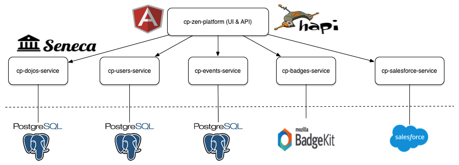

# Community Platform (Zen) Architecture

Zen se compone principalmente de un puñado de microservicios:

Estos servicios viven en los siguientes repositorios de código:

* [cp-zen-platform](https://github.com/CoderDojo/cp-zen-platform)
* [cp-events-service](https://github.com/CoderDojo/cp-events-service)
* [cp-badges-service](https://github.com/CoderDojo/cp-badges-service)
* [cp-salesforce-service](https://github.com/CoderDojo/cp-salesforce-service)
* [cp-dojos-service](https://github.com/CoderDojo/cp-dojos-service)
* [cp-users-service](https://github.com/CoderDojo/cp-users-service)

## cp-zen-platform

cp-zen-platform contiene todo el código de interface [AngularJS](https://angularjs.org/), así como también implementa los REST API del lado del servidor. El servidor está escrito utilizando el entorno [Hapi](http://hapijs.com/). Las llamadas al REST API son en su mayoría llamadas al proxy a través de microservicios [Seneca](http://senecajs.org/).

## cp-events-service

El servicio de eventos implementa todos los eventos relacionados con la funcionalidad en el Zen. Los datos de eventos se almacena en [PostgresSQL](http://www.postgresql.org/).

## cp-badges-service

El servicio Badges implementa todas las funcionalidades relacionadas con Badges de Zend. Este servicio le habla a un [BadgeKit](http://badgekit.openbadges.org) a través de los BadgeKit API, todos los datos relativos al Badge están almacenados en BadgeKit.

## cp-salesforce-service

The Salesforce service implements all the Salesforce related functionality in Zen. This service talks directly to [Salesforce](https://developer.salesforce.com/). Salesforce is used internally by the CoderDojo Foundation staff.

## cp-dojos-service

The Dojos service implememts all the Dojos related functionality in Zen. All dojo related data is stored in [PostgresSQL](http://www.postgresql.org/).

## cp-users-service

The Users service implememts all the User related functionality in Zen. All user data is stored in [PostgresSQL](http://www.postgresql.org/).

## External Services

The full list of external services that Zen integrates with is as follows:

* [NodeBB](https://nodebb.org/) - Mentor & Youth Forums
* [Google Apps Gmail, reCAPTCHA](https://developers.google.com/) - auto-creating emails
* [Google Maps](https://maps.google.com) - Google Maps
* [Salesforce](https://www.salesforce.com/) - Salesforce
* [Intercom](https://www.intercom.io/) - Intercom
* [New Relic](http://newrelic.com/) - New Relic
* [CrowdIn](https://crowdin.com/project/zen-community-platform) - Localization Management Platform
* [Mozilla BadgeKit](http://badgekit.openbadges.org/) - Open Badges
* [MailTrap](https://mailtrap.io/) - Email testing

## Hosting

Zen is deployed on [AWS](http://aws.amazon.com/) and also uses a plethora of AWS services, none of which are directly used from the code above. How Zen is built & deployed is beyond the scope of this document.
