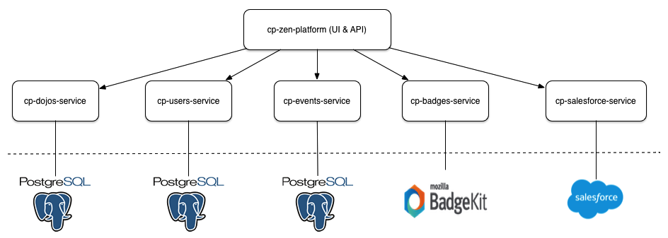

# Community Platform (Zen) Architecture

Zen is primarily composed of a handful of microservices:

These services live in the following code repositories:

* [cp-zen-platform](https://github.com/CoderDojo/cp-zen-platform)
* [cp-events-service](https://github.com/CoderDojo/cp-events-service)
* [cp-badges-service](https://github.com/CoderDojo/cp-badges-service)
* [cp-salesforce-service](https://github.com/CoderDojo/cp-salesforce-service)
* [cp-dojos-service](https://github.com/CoderDojo/cp-dojos-service)
* [cp-users-service](https://github.com/CoderDojo/cp-users-service)

## cp-zen-platform

cp-zen-platform contains all the front end Angular JS code, as well as implementing the backend REST API server. The server is written using the [Hapi](hapijs.com) framework. The REST API calls are mostly proxy calls through to [Seneca](senecajs.org) microservices.

## cp-events-service

The Events service implememts all the Events related functionality in Zen. The event data is stored in [PostgresSQL](www.postgressql.org).

## cp-badges-service

The Badges service implements all the Badges related functionality in Zen. This service talks to a [BadgeKit](http://badgekit.openbadges.org) via the BadgeKit API, all Badge related data is stored in BadgeKit.

## cp-salesforce-service

The Salesforce service implements all the Salesforce related functionality in Zen. This service talks directly to Salesforce (which is used by the CoderDojo Foundation staff.

## cp-dojos-service

The Dojos service implememts all the Dojos related functionality in Zen. All dojo related data is stored in [PostgresSQL](www.postgressql.org).

## cp-users-service

The Users service implememts all the User related functionality in Zen. All user data is stored in [PostgresSQL](www.postgressql.org).
